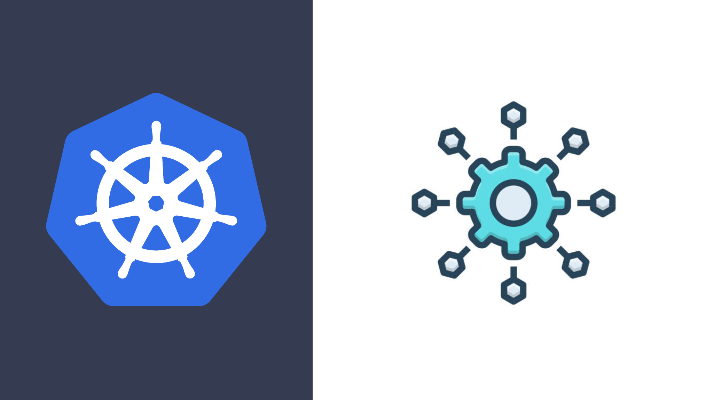

# Kubernetes From Scratch

This repo contains the source code for the kubernetes course.

## Cloud Native Application Development Series 

This course is particularly for any senior or staff level engineer who wants to learn Kubernetes From Scratch. 

### Kubernetes Architecture

- We will start with Kubernetes architecture
- The role of every cluster component
- Cluster creation with kind 

### Pod

- Deploy a workload using a basic build block which is Pod
- Access application log
- Access application container
- Access application API
- How to debug in case of issues
- Pod lifecycle
- Restart policy
- Environment variables
- Multi container pod / Sidecar container 

### Deployment
- Handling various revisions
- Rollout Strategy
- Rollback to Specific Revision
- Deployment Strategy

### Service
- How to do load balancing
- Service Discovery
- ClusterIP
- NodePort
- LoadBalancer

### Namespace
- Logical separation of Kubernetes resources in the cluster
- Creation and Deletion of namespaces

### Probes

- How to do health check
- Startup Probe
- Liveness Probe
- Readiness Probe

### Configuration Management

- Config Map
- How to manage application Secrets
- Injecting Environment Variables
- Injecting initialization scripts 

### Persistent Volume, Claims & StatefulSet

- Storage classes
- How to manage an application with persistent storage
- Claiming a storage via Dynamic Persistent Volume
- Headless Service
- Running Mongodb in Kubernetes

### Horizontal Pod Autoscaler
- Requesting and Limiting CPU and Memory resources for Pod container
- How to scale application based on CPU/Memory
- Application metrics

### Ingress
- Creating and implementing routing rules
- Host & Path based routing

### Kubernetes On Cloud
- Creating a cluster on Google cloud platform.
- Deploying our application
- Going global from local in minutes 